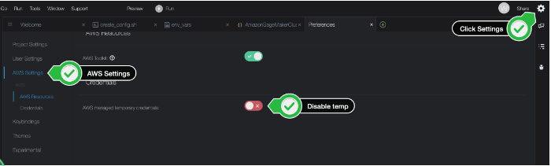

# SageMaker-HyperPod-Step-By-Step

# 1. Environment

# 2. Setup Infra Environment
## Create VPC: 
## Create FSX Luster
## Cloud9 설치
## Setup Cloud9
* install AWS CLI
    ```
    curl "https://awscli.amazonaws.com/awscli-exe-linux-x86_64.zip" -o "awscliv2.zip"
            unzip awscliv2.zip
            sudo ./aws/install --update
            aws --version
    ```
- First we need to disable the temporary credentials provided by Cloud9. Click on settings in the upper right hand corner > ⚙️ icon. Select AWS Settings > Disable aws managed temporary credentials
    - 


- Check the version is >= 2.14.3:
    ```
    aws --version
    ```    

# 3. Setup Role, Bucket
```
```
## Create IAM Role and Policy
 - source in all the environment variables 
    ```bash
    cd ~/environment
    curl 'https://static.us-east-1.prod.workshops.aws/public/5f0540d3-5a46-474e-87cd-ad022949e30c/static/scripts/create_config.sh' --output create_config.sh
    bash create_config.sh
    source ~/environment/env_vars
    ```
- Confirm all the environment variables were correctly set:
    ```
    cat ~/environment/env_vars
    ```
- Create IAM Role    
    ```bash
    cat > trust_relationship.json << EOF
    {
        "Version": "2012-10-17",
        "Statement": [
            {
                "Effect": "Allow",
                "Principal": {
                    "Service": "sagemaker.amazonaws.com"
                },
                "Action": "sts:AssumeRole"
            }
        ]
    }
    EOF

    aws iam create-role \
        --role-name AmazonSagemakerClusterExecutionRole-Demo \
        --assume-role-policy-document file://trust_relationship.json
    ```

- Export Role
    ```
    # export the role arn to the ~/environment/env_vars file
    ROLE=$(aws iam list-roles --query 'Roles[?RoleName==`AmazonSagemakerClusterExecutionRole-Demo`]' | jq '.[0].Arn' |  tr -d '"')
    echo "export ROLE=$ROLE" >> ~/environment/env_vars
    ```
- Attach policy
    ```
    aws iam attach-role-policy \
    --role-name AmazonSagemakerClusterExecutionRole-Demo \
    --policy-arn arn:aws:iam::aws:policy/AmazonSageMakerClusterInstanceRolePolicy
    ```

- Create VPC Policy and Attach it
    ```
    cat > vpc_policy.json << EOF 
    {
    "Version": "2012-10-17",
    "Statement": [
        {
            "Effect": "Allow",
            "Action": [
                "ec2:CreateNetworkInterface",
                "ec2:CreateNetworkInterfacePermission",
                "ec2:DeleteNetworkInterface",
                "ec2:DeleteNetworkInterfacePermission",
                "ec2:DescribeNetworkInterfaces",
                "ec2:DescribeVpcs",
                "ec2:DescribeDhcpOptions",
                "ec2:DescribeSubnets",
                "ec2:DescribeSecurityGroups",
                "ec2:DetachNetworkInterface"
            ],
            "Resource": "*"
        },
        {
            "Effect": "Allow",
            "Action": "ec2:CreateTags",
            "Resource": [
                "arn:aws:ec2:*:*:network-interface/*"
            ]
        }
    ]
    }
    EOF
    # create additional policy needed for FSx Lustre mount
    POLICY=$(aws iam create-policy \
        --policy-name AmazonSagemakerVPCPolicy \
        --policy-document file://vpc_policy.json | jq '.Policy.Arn' |  tr -d '"')

    # attach additional policy to the role we created above
    aws iam attach-role-policy \
        --role-name AmazonSagemakerClusterExecutionRole-Demo \
        --policy-arn $POLICY
    ```
- AWSCloud9SSMAccessRole 의 권한 추가 
    * AmazonS3FullAccess
    * AmazonSageMakerFullAccess
    * AmazonSSMFullAccess
    * AmazonSSMManagedInstanceCore
    * AWSCloud9SSMInstanceProfile
    * IAMFullAccess.
## Create S3 bucket and Lifecycle script
- Create bucket
    ```
    # generate a unique name for the bucket
    BUCKET="sagemaker-lifecycle-$(python3 -S -c 'import uuid; print(str(uuid.uuid4().hex)[:10])')"

    # create the bucket
    aws s3 mb s3://${BUCKET}

    # save the bucket name for later
    echo "export BUCKET=$BUCKET" >> ~/environment/env_vars
    ```
- Download the Lifecycle scripts    
    ```
    git clone https://github.com/aws-samples/awsome-distributed-training/
    cd awsome-distributed-training/1.architectures/5.sagemaker-hyperpod/LifecycleScripts/
    ```
-  upload to the bucket
    ```
    # upload data
    aws s3 cp --recursive base-config/ s3://${BUCKET}/src
    ```    

# 4. Create Cluster 
* ClusterName 설정.
    - [중요] 아래에 ClusterName 을 입력하세요.
    ```
    echo "export CLUSTER_NAME=ml-4-g5-48x-cluster" >> ~/environment/env_vars
    cd ~/environment
    source ~/environment/env_vars
    ```
- Create cluster-config.json:
    - [중요] InstanceType, InstanceCount 를 수정해서 사용하세요.
    ```
    cat > cluster-config.json << EOL
    {
        "ClusterName": "${CLUSTER_NAME}",
        "InstanceGroups": [
        {
            "InstanceGroupName": "controller-machine",
            "InstanceType": "ml.c5.xlarge",
            "InstanceCount": 1,
            "LifeCycleConfig": {
            "SourceS3Uri": "s3://${BUCKET}/src",
            "OnCreate": "on_create.sh"
            },
            "ExecutionRole": "${ROLE}",
            "ThreadsPerCore": 1
        },
        {
            "InstanceGroupName": "worker-group-1",
            "InstanceType": "ml.g5.48xlarge",
            "InstanceCount": 4,
            "LifeCycleConfig": {
            "SourceS3Uri": "s3://${BUCKET}/src",
            "OnCreate": "on_create.sh"
            },
            "ExecutionRole": "${ROLE}",
            "ThreadsPerCore": 1
        }
        ],
        "VpcConfig": {
        "SecurityGroupIds": ["$SECURITY_GROUP"],
        "Subnets":["$SUBNET_ID"]
        }
    }
    EOL
    ```    
- Create provisioning_parameters.json:
    ```
    instance_type=$(cat cluster-config.json | jq '.InstanceGroups[1].InstanceType')
    cat > provisioning_parameters.json << EOL
    {
    "version": "1.0.0",
    "workload_manager": "slurm",
    "controller_group": "controller-machine",
    "worker_groups": [
        {
        "instance_group_name": "worker-group-1",
        "partition_name": ${instance_type}
        }
    ],
    "fsx_dns_name": "${FSX_ID}.fsx.${AWS_REGION}.amazonaws.com",
    "fsx_mountname": "${FSX_MOUNTNAME}"
    }
    EOL
    ```        
- Upload that configuration to S3:
    ```
    # copy to the S3 Bucket
    aws s3 cp provisioning_parameters.json s3://${BUCKET}/src/
    ```
- Verify configuration on S3
    ```
    aws s3 cp s3://${BUCKET}/src/provisioning_parameters.json -
    ```    
- Create the cluster:
    ```
    aws sagemaker create-cluster \
    --cli-input-json file://cluster-config.json \
    --region $AWS_REGION
    ```    
- Describe the state of the cluster:
    ```
    aws sagemaker describe-cluster --cluster-name $CLUSTER_NAME --region $AWS_REGION
    ```

# 5. Setup Cluster 
-  install the SSM Session Manager Plugin
    - 아래는 Amazon Linux2 로 가정함.
    ```
    sudo yum install -y https://s3.amazonaws.com/session-manager-downloads/plugin/latest/linux_64bit/session-manager-plugin.rpm
    ```
- download a script easy-ssh.sh
    ```
    wget https://raw.githubusercontent.com/aws-samples/awsome-distributed-training/main/1.architectures/5.sagemaker-hyperpod/easy-ssh.sh
    chmod +x easy-ssh.sh
    ```
- easy_ssh Command to Head Node
    ```
     ./easy-ssh.sh -c controller-machine $CLUSTER_NAME
    ```    
-  switch to the ubuntu user:
    ```
    sudo su - ubuntu
    ```
- FileSystem 확인 (FsX Luster)   
    - /fsx 폴더가 보여야 함.
    ```
    df -h
    ```

# 6. SSH Access to compute node
- move the ubuntu user home directory to /fsx/ubuntu
    - ubuntu 유저가 로그인이 되어 있어, usermod 명령어 실행시에 에러가 발생하면 `ps -ef | grep ubuntu` 를 통해서 프로세스를 확인하고, 프로세스를 죽입니다.
    ```
    sudo su # go back to root user
    usermod -m -d /fsx/ubuntu ubuntu
    ```
- ensure all compute nodes have the same home directory
    - [중요] 아래에서 "4" 는 Compute Node 개수 만큼 기술 해야 합니다. 
    ```
    sudo su # go back to root user
    srun -N 4 usermod -d /fsx/ubuntu ubuntu
    ```
- login as ubuntu and ensure the home directory is correct:
    ```
    sudo su - ubuntu
    pwd # should show /fsx/ubuntu
    ```
- generate a new keypair and then copy it to authorized_keys file:
    ```
    # on headnode
    cd ~/.ssh
    ssh-keygen -t rsa -q -f "$HOME/.ssh/id_rsa" -N ""
    cat id_rsa.pub >> authorized_keys
    ```
- ssh into one of the compute nodes
    ```
    salloc -N 1
    ssh $(srun hostname)
    pwd # should show /fsx/ubuntu
    ```
- make sure you exit to the Head Node:    
    ```
    exit
    ```
- Run exit one more time to cancel the srun job:    
    ```
    exit
    ```
# 6. Train LLama2
- Git Repo:  https://github.com/aws-samples/awsome-distributed-training/
- Log in as ubuntu on HeadNode
    ```
    sudo su - ubuntu
    ```
- install git
    ```
    sudo apt install git
    ```
- Clone git
    ```
    git clone https://github.com/aws-samples/awsome-distributed-training/
    ```
- Move to the case example
    ```
    cd /fsx/ubuntu/awsome-distributed-training/3.test_cases/10.FSDP
    ```
- Run 0.create_conda_env.sh
    ```
    bash 0.create_conda_env.sh
    ```
- modify train parameters in 1.distributed-training.sbatch          
    - 아래 라임을 알맞게 수정하세요.
        - `#SBATCH --nodes=4 # number of nodes to use, 4 p4d(e) = 32 A100 GPUs`
    - `declare -a TORCHRUN_ARGS=( --nproc_per_node=4` 
    - 아래는 포트 번호를 지정 해줍니다. (수정 안하셔도 됩니다.)
        - `--rdzv_endpoint=$(hostname):29500 \`
    ```
    #!/bin/bash

    # Copyright Amazon.com, Inc. or its affiliates. All Rights Reserved.
    # SPDX-License-Identifier: MIT-0

    #SBATCH --nodes=4 # number of nodes to use, 4 p4d(e) = 32 A100 GPUs
    #SBATCH --job-name=FSDP # name of your job
    #SBATCH --exclusive # job has exclusive use of the resource, no sharing

    set -ex;

    ###########################
    ###### User Variables #####
    ###########################

    ###########################
    ## Environment Variables ##
    ###########################

    ## Plenty of EFA level variables
    #export FI_EFA_USE_DEVICE_RDMA=1 # use for p4d
    #export FI_EFA_FORK_SAFE=1
    #export FI_LOG_LEVEL=1
    #export FI_PROVIDER=efa
    export NCCL_DEBUG=INFO

    ###########################
    ####### Torch Dist  #######
    ###########################

    declare -a TORCHRUN_ARGS=(
        --nproc_per_node=4 \
        --nnodes=$SLURM_JOB_NUM_NODES \
        --rdzv_id=$SLURM_JOB_ID \
        --rdzv_backend=c10d \
        --rdzv_endpoint=$(hostname):29500 \
    )

    export TORCHRUN=./pt_fsdp/bin/torchrun
    export TRAIN_SCRIPT=./train.py

    ############################
    # Llama 2 Training Params ##
    ############################

    declare -a TRAINING_ARGS=(
        --max_context_width=4096 \
        --num_key_value_heads=32 \ # 7b: 32 13b: 40 70b: 8
        --llama_intermediate_size=11008 \ # 7b: 11008 13b: 13824 70b: 28672
        --hidden_width=4096 \ # 7b: 4096 13b: 5120 70b: 8192
        --num_layers=32 \ # 7b: 32 13b: 40 70b: 80
        --num_heads=32 \ # 7b: 32 13b: 40 70b: 64
        --model_type=llama_v2 \
        --tokenizer="hf-internal-testing/llama-tokenizer" \
        --checkpoint_freq=50 \
        --validation_freq=500 \
        --checkpoint_dir=./checkpoints \
        --train_batch_size=2 \
        --val_batch_size=4 \
        --epochs=1 \
        --validation_batches=1 \    
        --resume_from_checkpoint=./checkpoints
    )

    srun -l ${TORCHRUN} "${TORCHRUN_ARGS[@]}" $TRAIN_SCRIPT "${TRAINING_ARGS[@]}"
    ubuntu@ip-10-1-114-232:~/awsome-distributed-training/3.test_cases/10.FSDP$ 
    ```
- Job 의 실행 정보를 확인 합니다.
    ```
    sinfo
    squeue
    ```
- 훈련 셀을 실행합니다.
    ```
    sbatch 1.distributed-training.sbatch
    ```
- 훈련 결과를 확인 합니다. (slum-1.out 은 예시 입니다.)
    ```
    ls
    tail -30 sluum-1.out
    ```    


# 참조 자료


